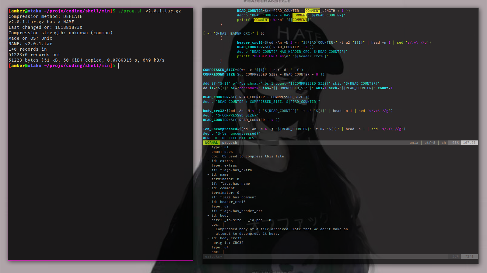

# About Me

## Peronal
I am a MtF trans trynna fit it with the tech nerds 😸. I like to tinker with libre FOSS things and, likewise, Linux.
## School
 I am a student of mathematics at [UCD](https://ucdenver.edu/), studying mathematics in the department of [Mathematical and Statistical Sciences](https://clas.ucdenver.edu/mathematical-and-statistical-sciences/) at [CLAS](https://clas.ucdenver.edu/).
## Skills
 I mainly work on FOSS projects and do things related to LaTeX, POSIX Shell, and C. I am currently learning dotnet CORE and ECMA javascript.
# Setup

